  

I build AI systems from experiment to interface: adapting models, evaluating their behavior, and shipping the tools that make them useful. My work spans **Multimodal Models**, **Agentic Systems**, **ML Evaluation**, and **Production AI Tools**.

  <code>Python</code>&nbsp;
  <code>PyTorch</code>&nbsp;
  <code>Transformers</code>&nbsp;
  <code>FastAPI</code>&nbsp;
  <code>Next.js</code>&nbsp;
  <code>TypeScript</code>

## Selected work

| Project | Engineering focus |
| :--- | :--- |
| **[Goal AI](https://github.com/Demetri65/goal-ai)** | FastAPI and Next.js research prototype that decomposes goals into measurable workstreams using structured AI planning. |
| **[Pixels to Predictions](https://github.com/Demetri65/dl-kaggle-competition-final)** | SmolVLM and LoRA pipeline for visual-science question answering, with a reported **76.66% public leaderboard score**. |
| **[Mapillary Snapshot Ingestion](https://github.com/Demetri65/iml-prototype)** | Next.js and FastAPI application for collecting and exploring street-level imagery. |
| **[SVG Kaggle Competition](https://github.com/Demetri65/svg-kaggle-competition)** | Qwen2.5-Coder and LoRA experiment for generating constrained, renderable SVG graphics. |
| **[Scheduler](https://github.com/Demetri65/scheduler)** | Tool-using scheduling agent that connects natural-language requests to Google Calendar operations. |
| **[WAI React](https://github.com/Demetri65/wai-react)** | React component and interaction-pattern library organized around WAI-ARIA semantics and Storybook documentation. |

## Working principles

- Treat evaluation as part of the product, not a final checkpoint.
- Prefer explicit tools, structured outputs, and observable workflows.
- Pair reproducible ML experiments with lightweight, accessible interfaces.
